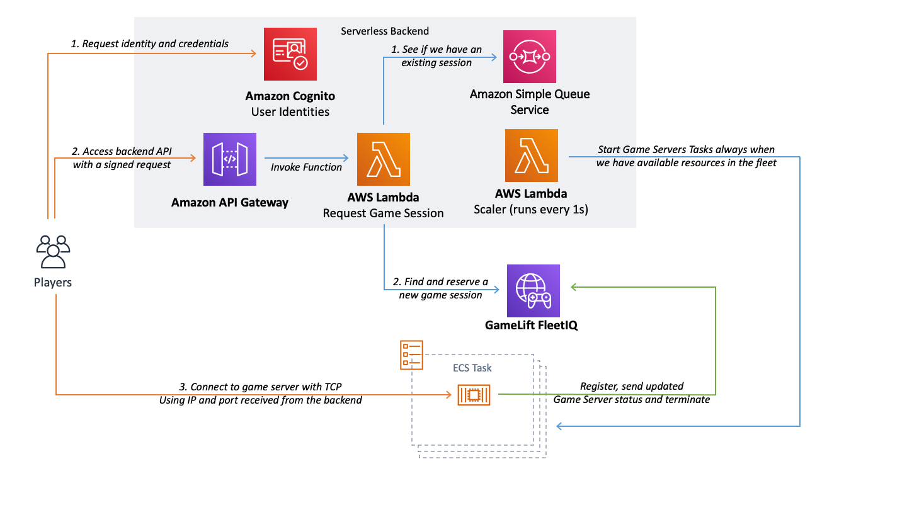

# Game Server Hosting on Amazon Elastic Container Service with Amazon GameLift FleetIQ

This repository contains an example solution on how to scale a fleet of game servers on Elastic Container Service and match players to game sessions using a Serverless backend. Game Sessions are managed by Amazon GameLift FleetIQ. All resources are deployed with Infrastructure as Code using CloudFormation, Serverless Application Model, Docker and bash scripts. With Amazon GameLift FleetIQ you can leverage Spot Instances with significant cost reductions compared to On-Demand Instances.

Check out the [Amazon GameLift FleetIQ documentation](https://docs.aws.amazon.com/gamelift/latest/fleetiqguide/gsg-intro.html) for more details on the service.

**NOTE:** This repository exists for **example purposes only** and you always need to build and validate your own solution for production use. Deploying the solution **will generate costs** beyond the AWS Free Tier.

# Key Features
* GameLift FleetIQ used to provision a Game Server Group. EC2 instances in the group will register to an ECS Cluster as workers
* Game Server Tasks deployed to the ECS Cluster by a serverless scaler service to always keep all instances fully utilized
* A Serverless API used for claiming game sessions from GameLift FleetIQ. Deployed with Serverless Application Model
* CloudFormation used to deploy all infrastructure resources
* Cognito used for player identities. Requests against the API are signed with Cognito credentials
* Unity used on both server and client side. Unity server build is deployed as a Linux Docker container

The client/server Unity project is a simple "game" where 2 players join the same session and move around with their 3D characters. The server receives input from the clients, simulation is run on the server side and world state is sent to the players and the characters created and removed as players join and leave.

# Contents

The project contains:
* **A Unity Project** that will be used for both Client and Server builds (`UnityProject`). Server build will be further built into a Docker container image and deployed to Elastic Container Registry as part of the deployment automation
* **A Backend Project** created with Serverless Application Model (SAM) to create an API backend for game session requests and a continuously running scaler function for creating game server Tasks (`BackendServices`)
* **Infrastructure deployment automation** leveraging AWS CloudFormation to deploy all infrastructure resources (`CloudFormationResources`)
* **A build folder for the server build** which includes a Dockerfile for building the docker image (`LinuxServerBuild`)

# Architecture Diagram

# Preliminary Setup

1. **Install and configure the AWS CLI**
    * Follow these instructions to install: [AWS CLI Installation](https://docs.aws.amazon.com/cli/latest/userguide/cli-chap-install.html)
    * Configure the CLI: [AWS CLI Configuration](https://docs.aws.amazon.com/cli/latest/userguide/cli-chap-configure.html#cli-quick-configuration)
2. **Install Unity3D 2019**
    * Use the instructions on Unity website for installing: [Unity Hub Installation](https://docs.unity3d.com/Manual/GettingStartedInstallingHub.html)
    * Install support for Linux builds for your Unity installation. You will need this for the server builds.
3. **Install SAM CLI**
    * Follow these instructions to install the Serverless Application Model (SAM) CLI: [SAM CLI Installation](https://docs.aws.amazon.com/serverless-application-model/latest/developerguide/serverless-sam-cli-install.html)
3. **Install Docker**
    * Follow the instructions on the Docker website to install it: [Get Docker](https://docs.docker.com/get-docker/)
4. **Install external dependencies**
    1. Download the AWS .NET SDK [here](https://sdk-for-net.amazonwebservices.com/latest/v3/aws-sdk-netstandard2.0.zip) and copy the following files to `UnityProject/Assets/Dependencies/`: `AWSSDK.CognitoIdentity.dll`, `AWSSDK.CognitoIdentityProvider.dll`, `AWSSDK.Core.dll`, `AWSSDK.GameLift.dll`, `AWSSDK.SecurityToken.dll`, `Microsoft.Bcl.AsyncInterfaces.dll`, `System.Runtime.CompilerServices.Unsafe.dll`, `System.Threading.Tasks.Extensions.dll`.
    2. Download the [Newtonsoft Json framework binaries](https://github.com/JamesNK/Newtonsoft.Json/releases/download/12.0.3/Json120r3.zip) and copy the file `Bin/net45/Newtonsoft.Json.dll` to `UnityProject/Assets/Dependencies/`. We will use this to serialize C# objects to Json when calling the Backend services. See [The official website](https://www.newtonsoft.com/json) for details on Newtonsoft Json framework.
    3. Download the [Signature Calculation Example from AWS Documentation](https://docs.aws.amazon.com/AmazonS3/latest/API/samples/AmazonS3SigV4_Samples_CSharp.zip): **Copy the folders** `Signers` and `Util` to `UnityProject/Assets/Dependencies/` folder. We will use these to sign the requests against API Gateway with Cognito credentials. You could implement a similar SigV4 signing process yourself. After this you should not see any errors in your Unity console.
5. **Select deployment Region**
    * The solution can be deployed to any Region supporting GameLift, ECS, SQS, Lambda, API Gateway and Cognito. See [The Regional Table](https://aws.amazon.com/about-aws/global-infrastructure/regional-product-services/) to validate your selected Region supports these services. You will need to configure the Region during the deployment.

# Deployment With Bash Scripts

1. **Set up Configuration Variables**
    * Open `configuration.sh` in your favourite text editor
    * Set the `region` variable to your desired region
    * Set the `accountid` to your AWS Account ID (12 digits without dashes)
    * Set the `deploymentbucketname` to a **globally unique** name for the code deployment bucket
2. **Deploy VPC, ECS and FleetIQ Game Server Group Resources**
    * Go to `CloudFormationResources` in your terminal
    * Run `./deploy-vpc-ecs-resources.sh` to deploy a Virtual Private Cloud (VPC), ECS Cluster and the FleetIQ Game Server Group to host your game server containers.
3. **Set the RegionEndpoint to Server.cs**
    * Open `UnityProject/Assets/Scripts/Server/Server.cs` in your favourite editor
    * Set the `RegionEndpoint regionEndpoint` to your selected Region
4. **Build the server**
    * Open Unity Hub, add the UnityProject and open it (Unity 2019.2.16 or higher recommended)
    * In Unity go to "File -> Build Settings"
    * Go to "Player Settings" and find the Scripting Define Symbols ("Player settings" -> "Player" -> "Other Settings" -> "Scripting Define Symbol")
    * Replace the the Scripting Define Symbol with `SERVER`. Remember to press Enter after changing the value. C# scripts will use this directive to include server code and exclude client code
    * Close Player Settings and return to Build Settings
    * Switch the target platform to `Linux`. If you don't have it available, you need to install Linux platform support in Unity Hub.
    * Check the box `Server Build`
    * Build the project to the `LinuxServerBuild` folder (Click "Build" and in new window choose "LinuxServerBuild" folder, enter "FleetIQExampleServer" in "Save as" field and click "Save"). **NOTE**: It's important to give the exact name `FleetIQExampleServer` for the build as the Dockerfile uses this.
5. **Build Docker Image and Deploy Task Configuration**
    * Make sure you have Docker installed and running
    * Run `CloudFormationResources/deploy-game-server-and-update-task-definition.sh` to build the docker image, create an ECR repository and upload the image and deploy the Task Definition
6. **Deploy the Backend Services with SAM**
    * Make sure you have the SAM CLI installed
    * Run the `BackendServices/deploy.sh` script to deploy the backend Services.
    * You should see the Scaler function starting quickly after the Stack is deployed to run every minute. It will populate the ECS Instances with as many ECS Tasks as possible, each hosting a single game server container that registers to FleetIQ
7. **Set the API endpoint to the Unity Project**
    * Set the value of `static string apiEndpoint` to the endpoint created by the backend deployment in `UnityProject/Assets/Scripts/Client/MatchmakingClient.cs`
    * You can find this endpoint from the `fleetiq-ecs-game-servers-backend` Stack Outputs in CloudFormation or from the API Gateway console (make sure to have the `/Prod/` in the url)
8. **Deploy Cognito Resources**
    * Run `CloudFormationResources/deploy-cognito-resources.sh` to deploy
9. **Set the Cognito Identity Pool configuration**
    * Set the value of `static string identityPoolID` to the identity pool created by the Cognito Resources deployment in `UnityProject/Assets/Scripts/Client/MatchmakingClient.cs`. (You can find the ARN of the Identity Pool in the CloudFormation stack `fleetiq-ecs-game-servers-cognito`, in IAM console or as output of Step 8)
    * Set the value of `public static string regionString` and `public static Amazon.RegionEndpoint region` to the values of your selected region
10. **Build and run two clients**
    * Set the the Scripting Define Symbol `CLIENT` in the *Player Settings* in the Unity Project (File -> "Build Settings" -> "Player settings" → "Player" → "Other Settings" → "Scripting Define Symbol" → Replace completely with "CLIENT")
    * Open the scene "GameWorld" in Scenes/GameWorld
    * Open Build Settings (File -> Build Settings) in Unity and set target platform to `Mac OSX` (or whatever the platform you are using) and **uncheck** the box `Server Build`
    * Build the client to any folder (Click "Build", select your folder and click "Save")
    * You can run two clients by running one in the Unity Editor and one with the created build. This way the clients will get different Cognito identities. If you run multiple copies of the build, they will have the same identity. In this solution it doesn't matter but if your backend starts using the identity for player data, then it might.
    * You should see the clients connected to the same game session and see the movements synchronized between clients.

## Replacing the game servers

The example doesn't contain a CI/CD pipeline to automate the replacement of game server Tasks. This is something you can automate to your needs using your preferred CI/CD tooling.

The process for replacing game servers:

1. Modify the server code and build a new Linux server build
2. Build the container image, push it and update the Task Definiton by running `CloudFormationResources/deploy-game-server-and-update-task-definition.sh`
3. Terminate the existing game server Tasks in the ECS Console by selecting the Cluster, selecting the "Tasks" and clicking "Stop all"
4. The scaler function will now replace the Tasks with the latest Task definition and container image.

**NOTE**: As the game servers terminate unexpectly, they will actually be listed within the Game Server Group for some minutes before they are cleaned up. Deregistering all existing game servers should be done separately with the AWS CLI to avoid this.

# Implementation Overview

## Infrastructure

The AWS Infrastructure for the solution consists of
* a **VPC** with public subnets across two Availability Zones to host the ECS Instances on top of which we will deploy the ECS game server Tasks (`CloudFormationResources/ecs-resources.yaml`)
* an **ECS Cluster** that is used to host the ECS Tasks (`CloudFormationResources/ecs-resources.yaml`)
* a **GameLift FleetIQ Game Server Group** that maps to an Auto Scaling Group of instances that register to the ECS Cluster and use the ECS AMI. This Game Server Group will scale based on the percentage of available game servers using Target Tracking. (`CloudFormationResources/ecs-resources.yaml`)
* a **Cognito Identity Pool** that is used to store the player identities (`CloudFormationResources/cognito.yaml`)
* an **ECS Task Definition** that defines the Task to be run in public subnets of the VPC using the game server image uploaded to ECR. The Tasks use bridge-networking and HostPort 0 to get a dynamic port at launch. The Security Group of the instances allow access to the dynamic port range from the internet. (`CloudFormationResources/game-server-task-definition.yaml`)

### Game Server Group

The Amazon FleetIQ Game Server Group is created using a Launch Template. The Launch Template uses the ECS AMI and User Data to register the instances to the ECS Cluster. This way the instances are available for Tasks once they are online. The Game Server Group is scaled based on the availability of game servers using Target Tracking. The default value is 75% utilized game servers as a target. Once new EC2 instances are launched, they will be populated by game server Tasks by the scaler Lambda function.

See `CloudFormationResources/ecs-resources.yaml` to modify the minimum (default 2) and maximum (default 3) of instances in the Auto Scaling Group as well as the Target Tracking (default 75% utilized) and Instance type configuration (default c5.xlarge and m5.xlarge). We use "SPOT_PREFERRED" to prefer Spot instances and fail over to On-Demand Instances in case Spot Isntances are not viable for hosting game sessions.

## Serverless Backend Services

The Serverless Backend Services are deployed with SAM (Serverless Application Model). The backend consists of
* a **scaler function** (`BackendServices/functions/scaler.py`) that will run every minute using a CloudWatch Events scheduled event. The function runs around 58 seconds and checks every 1 second if new game servers should be started based on the available resources (CPU and memory) across all the Container Instances in the Game Server Group. It uses the latest Task Definition to start new ECS Tasks in the ECS Cluster. Tasks will always utilize the resources available as fully as possible. 
* a **function to request a games session** (`BackendServices/functions/requestgamesession.py`) that is called by the game client through API Gateway to request a new game session. The function will check if there is a game session in the SQS waiting for another player. If not, it will claim a game server through the FleetIQ API and put a message to the queue with session information for the next player. The function returns the IP and port to connect to. **NOTE:** This is just a simple example and not a full matchmaking solution. For example, if the first player drops from the session before another one gets it from SQS, the session information is still provided to the second client and the connection will fail. The client has an automatic retry to mitigate this
* an **API Gateway** that uses AWS_IAM authentication to authenticate game clients with their Cognito credentials

The backend service infrastructure is defined in `BackendServices/template.yaml` and is deployed with SAM using `BackendServices/deploy.sh`.

## Game Server

The game server is developed with Unity in the same project (`UnityProject`) as the client. Using the Scripting Define Symbol `SERVER` will define it as a server build. The server is built as part of deploying the Task definition by creating a Docker image of the server locally (using the latest build in LinuxServerBuild) and uploading that to an ECR repository. See `LinuxServerBuild/Dockerfile` for the definition of the Docker image. It uses an Ubuntu base image but you could replace this with more lightweight options as well.

Key Server functionality:
 * Starts a TcpListener and starts accepting clients
 * Accepts clients up the the maximum amount of players and keeps track of connected clients
 * Takes player input in and shares simulation state to clients (position updates etc.) over TCP
 * Terminates the process once the game session is done (players disconnected)
 * Registers, updates health and deregisters from the FleetIQ Game Server Group

**Key code files:**
  * `Scripts/Server/Server.cs`: This class contains all the server logic and a NetworkServer class that manages the TCPListener and clients. It also contains all the logic to communicate with GameLift FleetIQ using the AWS .NET SDK.
  * `Scripts/NetworkingShared/MessageClasses.cs`: Defines the SimpleMessage class that is serialized and deserialized by the server and clients to transmit messages
  * `Scripts/NetworkingShared/NetworkProtocol.cs`: Defines the sending and receiving of messages with TCP Clients using BinaryFormatter and the SimpleMessage message class. Used by both server and client

## Game Client

The game client is developed with Unity in the same project (`UnityProject`) as the server. Using the Scripting Define Symbol `CLIENT` will define it as a client build.

The client will
 * Request an identity from Cognito Identity Pool by using the AWS .NET SDK (`Scripts/Client/Client.cs`)
 * Once the credentials are received, sign a request to API Gateway to request a game session (`Scripts/Client/MatchmakingClient.cs`)
 * Once the response to the game session has been received, connect to the game server with the given public IP and port
 * Start sending and receiving updates using a TCPClient

# Cleaning Up Resources

To clean up all the resources you need to make sure that the correct region is defined in `configuration.sh` and then run `cleanup_all_resources.sh`.

**NOTE**: There is one manual step in the clean up where you need to stop all Tasks running in the ECS Cluster.

# License

This example is licensed under the MIT-0 License. See LICENSE file.
